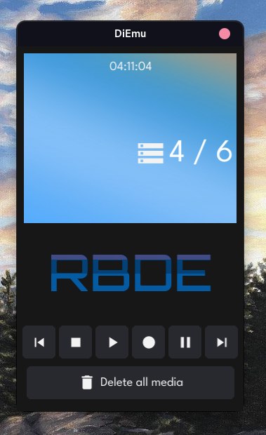

# Really _Questionable_ Dictaphone Emulator
Simple sound-manipulating program written using [Fyne](https://github.com/fyne-io/fyne) and [Malgo](https://github.com/gen2brain/malgo).

Learning project.
## Demo
- Crossplatform* - Windows, GNU/Linux, OpenBSD, MacOS, <s>Android</s>
- Change theme using environment variable "FYNE_THEME" (white, dark)
- Custom font support using e.v. "FYNE_FONT" or by adding "font.ttf" in app directory
- Custom wallpaper support (actually a "bug", TODO)

(*) Non-linux builds were not tested

## Platforms
### Sound
| Platform | Sound Dependencies |
|--|--|
| Linux | PulseAudio, ALSA, JACK |
| Windows | WASAPI, DirectSound, WinMM |
| FreeBSD/NetBSD/OpenBSD | OSS/audio(4)/sndio |
| macOS | CoreAudio |
| Android | OpenSL/ES, AAudio |

## Build
```sh
git clone https://github.com/OutOfContainment/RBDE.git && cd ./RDBE
go build -o bin/RDBE
```
